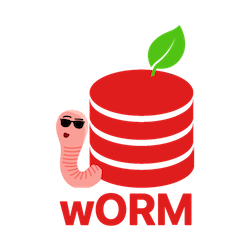

# Worm - Easy Java ORM



Insanely easy way to work with Java and MySQL

## 1. Download

Download the library - [Worm-Library-1.0.jar](documentation/worm-library-1.0.jar) 
```
Import the WormLibrary.jar to your project
```

## 2. How does it help.

Worm is intended to simplify the interaction with MySQL database in Java.

* It eliminates writing SQL queries to interact with MySQL db.
* It takes care of creating your database.
* It manages object relationships too.
* It provides you with clear and simple APIs for db operations

## 3. What it provides

There are two parts to it:

* database creation
* simple APIs to manipulate your business objects

## 4. [Getting started](documentation/GettingStarted.md)

# Documentation

[Complete Documentation](documentation/Documentation.md)

[Example](documentation/Example.md)


# Development

The people who put their effort and sweat into this project

| Name         | Github         |
|--------------|----------------|
| Kevin Gamboa | [@KevinGamboa17](https://github.com/kevingamboa17)|
| Adrián Leyva | [@AdrianLeyva](https://github.com/AdrianLeyva)|
| Marco Chavez | [@MarcoChavez1940](https://github.com/MarcoChavez1940)|