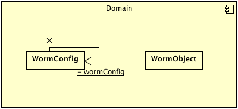
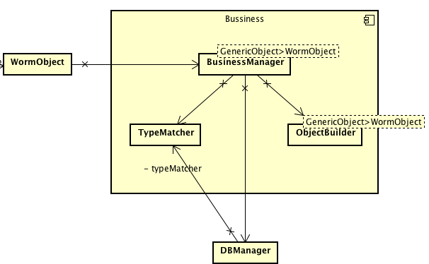
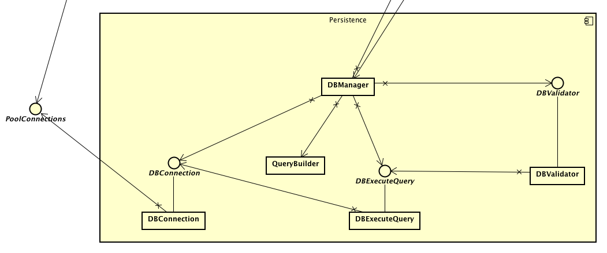

# Description of functionality

### Main Goal
Worm is an easy Java ORM, It can simplify the way to persistence java objects into a mysql database.

### Funcionality
* Create a database for your project/ You can use a created one
* Create tables in the db/ You can use created ones
* Insert in java objects in the db
* Update java objects in the db
* Delete java object in the db
* Get a java object from the db
* Get all the java objects from the db

# Components description

* **Domain**
* **Bussiness**
* **Persistence**

## Domain

**Description:** This module let the user to use worm, here can access to all the functions of the framework 

**Dependencies with other components:**
    
    * All the methods from `BussinessManager`

**Exit Interfaces:** Null

**Input Interfaces:** 

    * Pool of connections, this is optional, if the user has a pool.

**Artifacts:** Null

**Diagram:**

## Bussiness

**Description:** This module handle the reflexion and introspections of the objects to be persisted.

**Dependencies with other components:** 

    * WormObject: The object that can be handle by the program.
    * DBManager: To persist the objects that have been prepared.

**Exit Interfaces:** Null

**Input Interfaces:** Null

**Artifacts:** 
    
    * Java.reflect package to the persitence and reflexion of the objects

**Diagram:**

## Persistence

**Description:** This module persist the objects into the mysql db.

**Dependencies with other components:** 
    
    * FieldWormType: To get the information of the java object to persist it in the db.

    * WormConfig: To get the information of the mysql server to be connected and in case of exist, the pool of connections.

**Exit Interfaces:** Null

**Input Interfaces:** Null

**Artifacts:** 
    
    * MySQL Connector Library: To handle all the actions for the db.

**Diagram:**

# JavaDoc

[JavaDoc](#)

[Complete Class Diagram](diagrams/Class-diagram.png)

# [Example of use](Example.md)